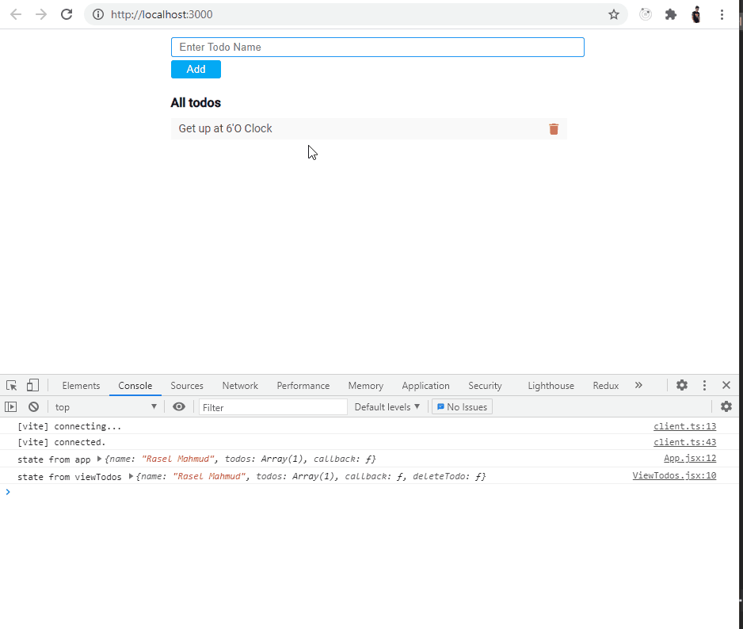

# React Context Api with nice organized Like Redux js, but it is Simple  ###
Here I am implement content api like redux concept 
actions, connect, Provider.

But current not added reducer to keep simplicity.


to know more details visit  https://reactjs.org/docs/context.html

# When we not use
When Out App Growth Big then we need to use redux like library to keep state, action clear and organized.

# When We use context api 
actually from my experience, I use context api when my application need 
globally state but it not more complex.
Like store **Authentication**, **posts**, **small blog site**.
my portfolio site use context api to manage my site.   


#Application Preview



# Project tree
I create three type file inside context directory

* [src](./src)
    * [components](./src/components)
      * [AddTodo.jsx](./src/components/AddTodo.jsx)
      * [ViewTodos.jsx](./src/components/ViewTodos.jsx)

    * [context](./src/context)
        * [connect.jsx](./src/context/connect.jsx)
        * [Provider.jsx](./src/context/Provider.jsx)
        * [actions.js](./src/context/actions.js)
    


    

```jsx
// Provide.jsx
import React from "react";
import { MyContext } from "./connect";

/**
* it just context Provider wrapper and extra function state shared that contains reactive state
* */

function Provider(HOC){
    return function (props){
        const [state, setState] = React.useState(  {
          name: "Rasel Mahmud",
          todos: [{title: "Get up at 6'O Clock", id: 1}]
        })
    
        
        // it call when action function call dispatch function. from connect HOC component
        // so that out state globally updated
        function callback(updateState){
          setState(updateState)
        }
        
        return (
          <MyContext.Provider value={{...state, callback: callback }} >
            <HOC {...props} />
          </MyContext.Provider>
        )
    }
}
export default Provider
```
Use Provider inside main.js


```jsx
//main.js
import {BrowserRouter} from "react-router-dom";
import Provider from "./context/Provider";

// Wrap App with Context Provider and a functional component state
const AppContextWrapper = Provider(App)

ReactDOM.render(
  <React.StrictMode>
    <BrowserRouter>
      <AppContextWrapper />
    </BrowserRouter>
  </React.StrictMode>,
  document.getElementById('root')
)

```

## well. we provide our Context With Another Anonymous Functional Component State that's Reactive.
<p>And we pass a callback function that take newState and update out reactive (state) and all component will be updated.</p>


```jsx
// ViewTodos.jsx
import React from 'react';
import connect from "../context/connect";
import { deleteTodo } from  "../context/actions"

const ViewTodos = (props) => {
console.log("state from viewTodos", props)
  return (
    <div className="todo_view_component">
      <h4>All todos</h4>
      <ul className="todos">
        { props.todos && props.todos.map((todo, i)=> (
            <li className="todo" key={i}>
              <span>{todo.title}</span>
              <i className="fa fa-trash" onClick={()=> props.deleteTodo(todo.id)} />
            </li>
          )
        )}
      </ul>
    </div>
  );
};

// we pass out action func to get return another function with params (dispatch and state) that use inside acrions.js
export default connect(ViewTodos, { deleteTodo })
```

## Let's go into our actions.js
```javascript
// actions.js
export const deleteTodo = (todoId)=>{
  return function (dispatch, state){
    // console.log(dispatch, state)
    let updateState = {
      ...state, todos: state.todos.filter(t=>t.id !== todoId)
    }
    dispatch(updateState)
  }
}


export const addTodo = (newTodo)=>(dispatch, state)=>{
  dispatch({...state, todos: [...state.todos, newTodo]  })
}
``` 
## YaHu! It's Magic? No. its just Logic.


```jsx
// AddTodo.jsx
import React from 'react';
import connect from "../context/connect";
import {addTodo} from "../context/actions";

const AddTodo = (props) => {
  const [title, setTitle] = React.useState("")
  
  function addTodoHandler(e){
    props.addTodo({id: Date.now(), title, isComplete: false})
    setTitle("")
  }
  
  return (
    <div className="addTodo_component">
      <input type="text"
             value={title}
         placeholder="Enter Todo Name"
         onChange={(e)=>setTitle(e.target.value)}/>
      <button onClick={addTodoHandler} type="button" >Add</button>
    </div>
  );
};

export default connect(AddTodo, { addTodo });
```


